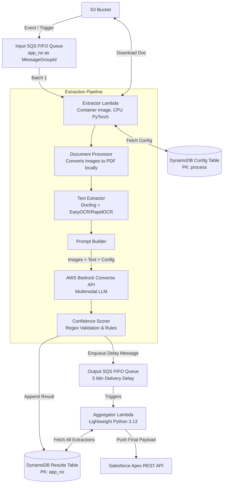

# EnFin AI Document Extraction System

This repository contains a modular, configuration-driven, and highly scalable serverless architecture for extracting structured data from documents (PDFs and images) using a combination of **Docling** (for format-preserving OCR and text extraction) and **AWS Bedrock LLMs** (for intelligent multimodal extraction).

It replaces the legacy `EnFin_AI_M0_Utility_Extraction` and provides a generalized framework where any new document type can be added simply by dropping a new configuration into DynamoDB.

---

## 🏗️ 1. Architecture Overview

The system utilizes a decoupled, two-Lambda architecture connected by SQS FIFO queues.



### Key Architectural Patterns
1. **Thin Handler & Controller Delegation**: The main `lambda_function.py` is extremely minimal and delegates everything to `Controller`.
2. **Lazy Loading of Heavy Dependencies**: To avoid Lambda initialization timeouts, heavy libraries like `torch`, `docling`, `easyocr`, and `PyMuPDF` (`fitz`) are only imported inside the specific functions that use them.
3. **Image Support via PDF Embedding**: Standalone images (PNG, JPG, TIFF) are dynamically embedded into a blank PDF using `fitz` before passing to Docling. This ensures uniform processing logic for all file types.
4. **Delay-Based Aggregation**: The Extractor Lambda drops individual file results into DynamoDB using `list_append`. It then fires a message to the Output SQS queue with a **5-minute delay**. The Aggregator Lambda picks this up 5 minutes later, pulls all results for that `app_no` from DynamoDB, and pushes them to Salesforce in one payload.

---

## ⚙️ 2. Configuration-Driven Extraction

The core feature of this framework is that **no extraction rules are hardcoded in Python**.
Everything is driven by the DynamoDB Config Table (e.g., `EnFin_AI_Document_Extraction_Config_Dev`).

The partition key for this table is **`process`** (e.g., `m0_utility_bill`).

When a message like `{"path": "...", "process": "m0_utility_bill"}` enters the Input SQS, the Extractor Lambda pulls the configuration for `m0_utility_bill`.

### How to Configure a New Process

To add support for a new document type (e.g., `w2_form` or `solar_contract`), simply insert a new item into the DynamoDB Config Table.

Here is the exact structure your DynamoDB item must follow:

```json
{
  "process": "your_process_name",
  "description": "Human readable description of the process",
  "entities": {
    "field_1": {
      "identification": "Description of the field for the LLM to understand",
      "expected_labels": ["Label 1", "Label 2"],
      "location_hints": ["Top right", "Page 2"],
      "keywords": ["Label 1", "Keyword for confidence scoring"],
      "regex": "^[A-Z0-9]{5,10}$"
    },
    "field_2": {
      "identification": "Date of the agreement",
      "regex": "^\\d{2}/\\d{2}/\\d{4}$"
    }
  },
  "extraction_prompt": "Optional custom prompt template with {docling_text} and {field_details} merge fields.",
  "conditional_responses": [
    {
      "conditions": {
        "state": "CA",
        "doc_type": "contract"
      },
      "additional_fields": {
        "program_id": "CAL-EMP-01"
      }
    }
  ]
}
```

### Understanding the Config Object

| Property | Description |
|----------|-------------|
| `entities` | A dictionary of fields to extract. The keys (e.g., `account_number`) will be the exact keys returned in the JSON output. |
| `identification` | Instructions inserted directly into the `<steps_to_follow>` of the LLM prompt. Tell the LLM exactly what this field is. |
| `location_hints` | Inserted into the LLM prompt to help the multimodal vision model visually locate the field on the page images. |
| `regex` | Used by the **Python-side Confidence Scorer**. If the LLM extracts a value, it is validated against this Regex. If it fails, the confidence score drops to `0.75`. |
| `keywords` | Used by the **LLM reasoning step**. The LLM checks for these keywords near the value to determine its internal `CERTAIN` or `UNCERTAIN` label. |
| `extraction_prompt` | If left blank, the system uses a highly optimized default multimodal prompt. If provided, you MUST include the literal strings `{field_details}` and `{docling_text}` so the code can dynamically inject them. |
| `conditional_responses` | A list of rules. If the LLM successfully extracts values that match the `conditions`, the Python pipeline will mechanically append the `additional_fields` to the final output payload. |

---

## 🧠 3. Built-In Confidence Scoring Rules

The `ConfidenceScorer` runs post-LLM extraction and determines how reliable the data is based on strict, deterministic rules:

1. **Initial Score**: Maps the LLM's self-assessed confidence label (`CERTAIN`=0.95, `LIKELY`=0.85, `UNCERTAIN`=0.70).
2. **Docling Text Validation**: The scorer strips spaces and dashes from the extracted LLM value and checks if it exists *anywhere* in the highly-accurate Docling extracted text markdown. If it is NOT found in the Docling text, confidence drops to 0.75.
3. **Regex Format Validation**: The LLM value is checked against the DynamoDB `regex` field. If it mis-matches, confidence drops to 0.75.

The overall confidence is the average of all individual field scores.

Based on the environment variables `AUTO_ACCEPT_THRESHOLD` (default 0.95) and `FLAG_THRESHOLD` (default 0.80), the system outputs a `recommendation` of `auto_accept`, `flag_for_review`, or `manual_required`.

---

## 🚀 4. Deployment & Seed Data

### Seeding Configurations
We provided a helper script to populate your DynamoDB config table with the `m0_utility_bill` configurations without needing to write JSON manually.

```bash
# Seed the Dev table
python scripts/seed_config.py --table EnFin_AI_Document_Extraction_Config_Dev --region us-west-2
```

### Developing Locally
Ensure you have `pre-commit` installed. Our hooks will automatically run `Ruff` (linting/auto-fixing), `Bandit` (security), and `Flake8` (cyclomatic complexity constraints) before you can commit code.

```bash
# Run manually
pre-commit run --all-files
```

### SAM CLI Deployment
The `template.yaml` contains all Queues, Tables, and Lambdas, with configurable Environment parameters.

```bash
sam build
sam deploy --guided
```
